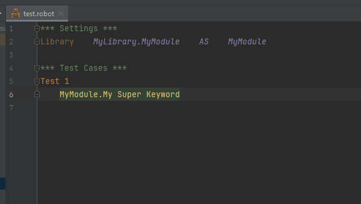
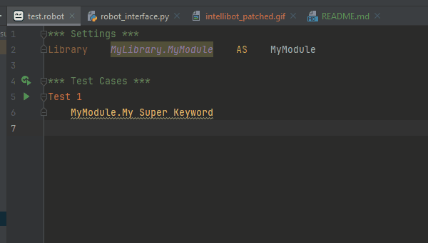

## Installation
1. git clone https://github.com/myjniak/hyper-robot-issue.git
2. create and activate venv
3. open Terminal in hyper-robot-issue/
4. pip install .

## IDE Setup
Set src/ as Sources Root

## Robot execution
> robot test

## How it should work and works for intellibot #patched

## How it works for Hyper Robot Framework Support

# Can you fix this dot notation module import? :)